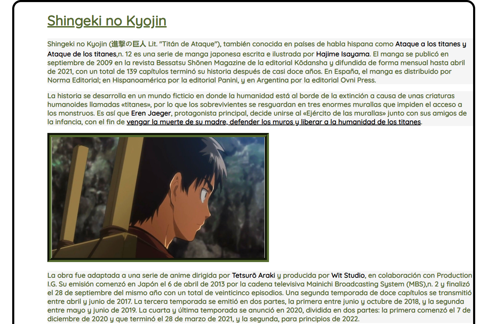
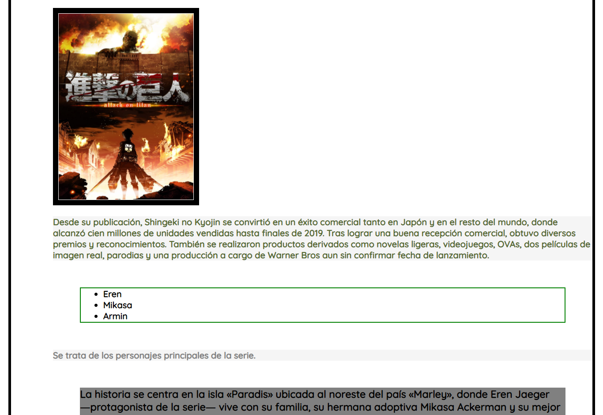
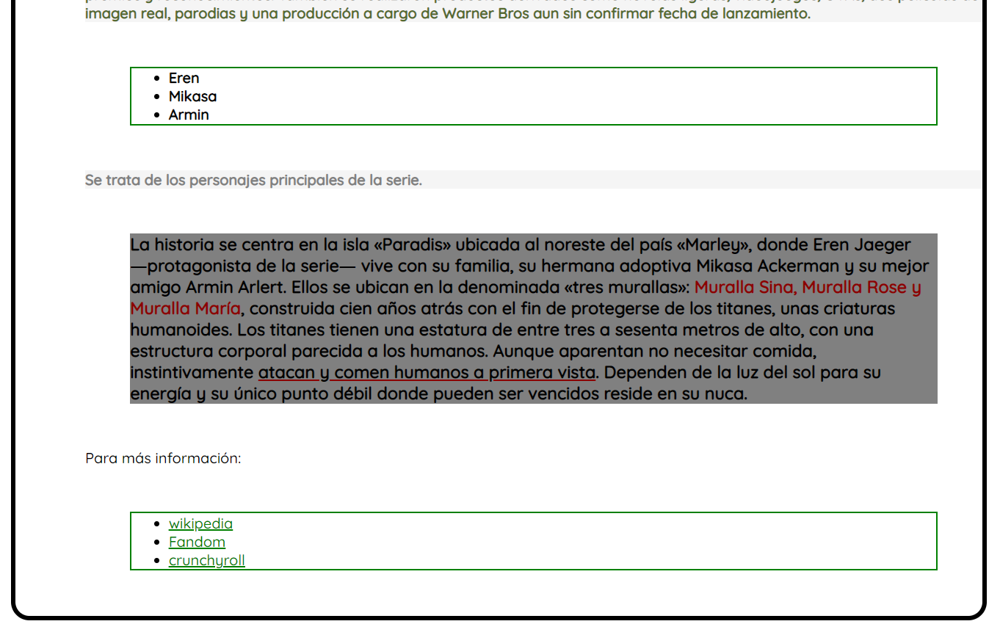

# Ejercicio de la página web

Ejercicio 1: Utilizar [Google Fonts](https://fonts.google.com/) para cambiar el tipo de fuente del documento.

Ejercicio 2: Utilizar [Font Awesome](https://fontawesome.com/) para añadir un icono de página.

Ejercicio 3: Añadir las siguientes imágenes del link: [Eren](https://i.pinimg.com/originals/0c/e3/11/0ce3110d84d343d638122697cc0bef9e.jpg) y [SNK](https://static.wikia.nocookie.net/shingeki-no-kyojin/images/5/53/Primera_temporada_%28parte_1%29.png/revision/latest?cb=20181015211526&path-prefix=es)

Ejercicio 4: Mediante una hoja de estilos externos se ha de aplicar formato a la página web de manera que:

  * Regla 1: Utilizar el selector universal `*` para cambiar el tipo de fuente del documento.
  * Regla 2: El elemento `selector` será color `darkolivegreen` y el ancho de la fuente será `bold`.
  * Regla 3: El elemento `body`tendrá un margen de `0`, el relleno del lateral derecho será del `5%`, el borde será `sólido`, `negro` y de `5px`. El radio del borde será de `20px` y el margen será de `5% 15%`.
  * Regla 4: El elemento `h1` estará `subrallado`, el texto alineado estará `justificado` y será color `darkolivegreen`.
  * Regla 5: El elemento `span` tendrá un font-weight de `900` y será de color `negro`.
  * Regla 6: La imagen `eren` tendrá un `50%` de anchura, el tipo de borde será `groove`, con una anchura de `10px` y el color del borde será `darkolivegreen`.
  * Regla 7: La imagen `snk` tendrá un `25%` de anchura, el tipo de borde será `solid`, con una anchura de `10px` y el color del borde será `negro`.
  * Regla 8: El elemento con id `subrallar` será de color `negro` y la decoración de texto será `underline`.
  * Regla 9: El elemento `murallas` será de color `darkred`.
  * Regla 10: El elemento `div>p` tendrá un fondo de color `whitesmoke`.
  * Regla 11: El elemento `h3` tendrá un fondo de color `grey` y tendrá un margen del `5%`
  * Regla 12: El elemento con id `titanes` tendrá una decoración de texto `underline` y el color de la decoración de texto será `darkred`.
  * Regla 13: El elemento `ul + p` tendrá un ancho de fuente `bold` y será de color `grey`.
  * Regla 14: El elemento `ul` tendrá un estilo de borde `sólido`, con un ancho de `2px`, de color `verde` y con un margen del `5%`.
  * Regla 15: El elemento `li`será de color `negro`.

Una vez hecho todo esto, la página web debería verse así:

